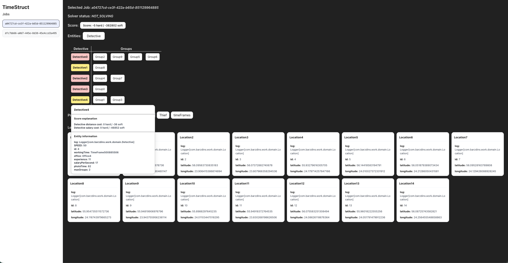

# timestruct-debug-ui

A debug UI tool for [Timefold](https://timefold.ai/) based Spring Boot applications. It provides a visual interface to inspect solver jobs, solution structures, and score explanations at runtime.

## Preview


---

## Requirements

- Java 17+
- Spring Boot
- Timefold Solver

---

## Installation

Add the dependency to your `pom.xml`:

```xml
<dependency>
    <groupId>io.github.reinisbarzdins</groupId>
    <artifactId>timestruct-debug-ui</artifactId>
    <version>1.0.1</version>
</dependency>
```

No additional configuration is required. The library uses Spring Boot auto-configuration and registers itself automatically when the dependency is present.

---

## Endpoints

All endpoints are served under the `/timestruct` prefix by default. The full list of available endpoints:

| Endpoint | Description |
|---|---|
| `GET /timestruct/ui` | Opens the debug UI in the browser — navigate to this URL to inspect your solver jobs visually |
| `GET /timestruct/jobs` | Returns a list of all active job IDs |
| `GET /timestruct/{jobId}` | Get details for a specific job |
| `GET /timestruct/{jobId}/solution-structure` | Get the solution structure for a specific job |
| `GET /timestruct/{jobId}/score-explanation` | Get the score explanation for a specific job |
| `GET /timestruct-config` | Returns the active API prefix (used internally by the UI to discover endpoints) |

### Custom Prefix

The default prefix is `/timestruct`. If it conflicts with your application's existing endpoints, you can override it in `application.properties`:

```properties
timestruct.api-prefix=/my-custom-prefix
```

All endpoints will then be available under `/my-custom-prefix/` (e.g. `/my-custom-prefix/ui`, `/my-custom-prefix/jobs`). The `/timestruct-config` endpoint always stays at its fixed URL so the UI can always discover the active prefix regardless of what it is set to.

---

## Integration

### 1. Implement `TimefoldSolutionAccess`

The debug UI has no direct access to your solver or your jobs — it doesn't know what planning problem you're solving or how you store your data. `TimefoldSolutionAccess` is the bridge between your application and the debug UI. By implementing this interface, you tell the library how to list your jobs, how to retrieve a solution by `jobId`, and how to check the solver status. Without it, the UI has nothing to display.

Create a `@Component` that implements the interface:

```java
@Component
public class MySolutionAccess implements TimefoldSolutionAccess {

    private final JobStore jobStore;
    private final SolverManager<?, String> solverManager;

    public MySolutionAccess(JobStore jobStore, SolverManager<?, String> solverManager) {
        this.jobStore = jobStore;
        this.solverManager = solverManager;
    }

    @Override
    public Collection<String> listJobIds() {
        return jobStore.listJobIds();
    }

    @Override
    public Object getSolution(String jobId) {
        Controller.Job job = jobStore.get(jobId);
        return job != null ? job.solution() : null;
    }

    @Override
    public Object getSolverStatus(String jobId) {
        return solverManager.getSolverStatus(jobId);
    }
}
```

### 2. Set up a Job and JobStore

> ⚠️ **This library requires a job-based architecture.** The debug UI is built around the concept of named jobs — each planning problem submitted to the solver must be stored and tracked by a unique `jobId`. Without this, the UI has no way to list, retrieve, or inspect solver runs.

A **Job** is a record that holds the current solution and any exception that may have occurred during solving:

```java
public record Job(MySolution solution, Throwable exception) {

    static Job ofSolution(MySolution solution) {
        return new Job(solution, null);
    }

    static Job ofException(Throwable error) {
        return new Job(null, error);
    }
}
```

A **JobStore** is an in-memory store that maps each `jobId` to its corresponding `Job`. Every time your application starts or updates a solver run, it should store the result in the `JobStore`. The debug UI queries the `JobStore` (via `TimefoldSolutionAccess`) to list all jobs and retrieve their solutions.

```java
@Component
public class JobStore {

    private final ConcurrentMap<String, Job> jobs = new ConcurrentHashMap<>();

    public Collection<String> listJobIds() {
        return jobs.keySet();
    }

    public Job get(String jobId) {
        return jobs.get(jobId);
    }

    public ConcurrentMap<String, Job> getMap() {
        return jobs;
    }

    public void put(String jobId, Job job) {
        jobs.put(jobId, job);
    }
}
```

The following is one example of how jobs can be stored using `solveBuilder()`. This is not the only way — jobs can be stored in memory, a database, or any other storage mechanism, as long as they are accessible via `TimefoldSolutionAccess`. The only requirement is that each job is identifiable by a unique `jobId`.

```java
@PostMapping
public String solve(@RequestBody SolveRequest request) {
    DSPsolution problem = createProblem(request);
    String jobId = UUID.randomUUID().toString();

    // Store the initial problem immediately
    jobIdToJob.put(jobId, Job.ofSolution(problem));

    solverManager.solveBuilder()
        .withProblemId(jobId)
        .withProblemFinder(id -> jobIdToJob.get(jobId).solution())
        .withBestSolutionConsumer(solution ->
            jobIdToJob.put(jobId, Job.ofSolution(solution)))
        .withExceptionHandler((id, exception) -> {
            jobIdToJob.put(jobId, Job.ofException(exception));
            log.error("Failed solving jobId ({}).", jobId, exception);
        })
        .run();

    return jobId;
}
```

The key points are:
- The job is stored **immediately** when the problem is submitted, before solving starts
- `withBestSolutionConsumer` updates the job in the store every time the solver finds a better solution
- `withExceptionHandler` stores any errors so the UI can display them
- The debug UI polls the store and always shows the latest available solution for each job

---

## Domain Class Requirement

> ⚠️ **Important:** Every domain class (planning entity, planning solution, etc.) **must** override `toString()` in the following format:

```java
@Override
public String toString() {
    return getClass().getSimpleName() + id;
}
```

This generates a unique string identifier for each object (e.g. `Shift1`, `Employee3`). The debug UI relies on these identifiers to correctly group, display, and reference entities and planning variables in the solution structure view.

Without this, the UI will use Java's default `toString()` output which includes a memory address (e.g. `com.example.Shift@6d06d69c`). This means:
- Different objects may produce identical or near-identical labels
- The UI cannot reliably group or distinguish entities
- Solution structure and score explanation views will be confusing or unreadable

---

## How It Works

The library follows a job-based model:

1. Your application submits planning problems as **jobs** with a unique `jobId`
2. The `JobStore` holds active jobs in memory
3. `TimefoldSolutionAccess` exposes jobs to the debug UI
4. The UI fetches job data via the REST endpoints and visualizes the solution structure and score explanation in real time
5. While the solver is running, the UI automatically refetches the current solution every **5 seconds**, so you can watch the solution improve live without manually refreshing the page

---

## License

MIT
